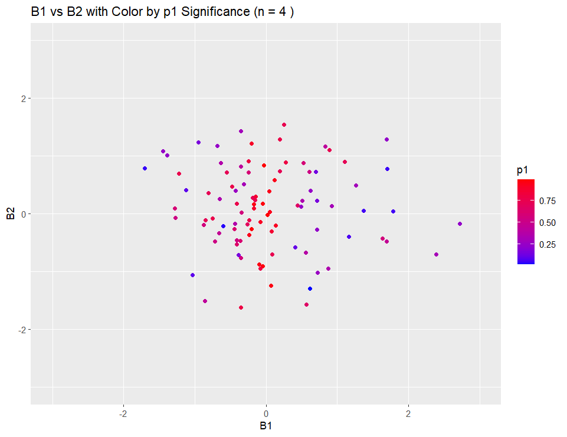

Evaluation of Linear Model simulation
================
Cemre Kefeli

For this analysis I will do a linear model simulation.

First we make a function for creating random data.

``` r
create_random_data <- function(n) {
  x1 <- rnorm(n, mean = 0, sd = 1)
  x2 <- rnorm(n, mean = 0, sd = 1)
  y <- rnorm(n, mean = 0, sd = 1)
  
  random_data <- data.frame(x1, x2, y)
  
  return(random_data)
}
```

Then, we make another function to create a vector that extract several
parameters of linear model.

``` r
get_lm_statistics <- function(data_frame) {
  # Fit a linear model
  lm_model <- lm(y ~ x1 + x2, data = data_frame)
  
  # Extract coefficients, t-values, p-values
  coefficients <- coef(summary(lm_model))
  t_values <- coefficients[, "t value"]
  p_values <- coefficients[, "Pr(>|t|)"]
  
  # Extract F-statistic and degrees of freedom
  f_statistic <- summary(lm_model)$fstatistic
  df1 <- f_statistic[2]
  df2 <- f_statistic[3]
  
  # Create a named vector with the desired statistics
  result <- c(B0 = coefficients[1],
              B1 = coefficients[2],
              B2 = coefficients[3],
              t0 = t_values[1],
              t1 = t_values[2],
              t2 = t_values[3],
              p0 = p_values[1],
              p1 = p_values[2],
              p2 = p_values[3],
              f = f_statistic[1],
              df1 = df1,
              df2 = df2)
  
  return(result)
}
```

And then we make a simulation that creates linear model 100 times.

``` r
# Define the number of simulations
num_simulations <- 100  # You can adjust this to your desired number of simulations

# Create an empty data frame to store the results
results_df <- data.frame(matrix(nrow = num_simulations, ncol = 13))
colnames(results_df) <- c("B0", "B1", "B2", "t0", "t1", "t2", "p0", "p1", "p2", "f", "df1", "df2", "pval")

# Perform the simulations
for (i in 1:num_simulations) {
  # Generate a random data frame
  random_df <- create_random_data(3)  # You can change 'n' as needed
  
  # Get the statistics from the linear model
  statistics_vector <- get_lm_statistics(random_df)
  
  # Extract and store the p-value for the F-statistic
  f_p_value <- pf(statistics_vector["f"], statistics_vector["df1"], statistics_vector["df2"], lower.tail = FALSE)
  
  # Store the results in the data frame
  results_df[i,] <- c(statistics_vector, pval= f_p_value)
}

# View the first few rows of the results data frame
head(results_df)
```

    ##            B0         B1          B2  t0  t1  t2  p0  p1  p2   f df1 df2 pval
    ## 1 -2.47831988  1.3913449 -2.43877698 NaN NaN NaN NaN NaN NaN NaN   2   0   NA
    ## 2  0.95362616 -0.4398014  0.25125548 NaN NaN NaN NaN NaN NaN NaN   2   0   NA
    ## 3  0.58897535  1.0770332  0.07616695 NaN NaN NaN NaN NaN NaN NaN   2   0   NA
    ## 4  0.43521461 -3.8518751  4.80977144 NaN NaN NaN NaN NaN NaN NaN   2   0   NA
    ## 5 -0.07471041 -3.1854246 -1.67942898 NaN NaN NaN NaN NaN NaN NaN   2   0   NA
    ## 6 -0.79516430 -0.3394573  0.25841789 NaN NaN NaN NaN NaN NaN NaN   2   0   NA

Using only 3 observations we can not calculate the p and t values. I
think this is due to not having enough degrees of freedom. I made a
linear model with three observations and in summary it suggests no
residual degrees of freedom.

``` r
lim <- lm(y ~ x1 + x2, random_df)
summary(lim)
```

    ## 
    ## Call:
    ## lm(formula = y ~ x1 + x2, data = random_df)
    ## 
    ## Residuals:
    ## ALL 3 residuals are 0: no residual degrees of freedom!
    ## 
    ## Coefficients:
    ##             Estimate Std. Error t value Pr(>|t|)
    ## (Intercept)   0.6230        NaN     NaN      NaN
    ## x1           -0.4607        NaN     NaN      NaN
    ## x2           -2.5569        NaN     NaN      NaN
    ## 
    ## Residual standard error: NaN on 0 degrees of freedom
    ## Multiple R-squared:      1,  Adjusted R-squared:    NaN 
    ## F-statistic:   NaN on 2 and 0 DF,  p-value: NA

When we increase the number of observations `lm` is able to calculate
the t-value and p-value.

However I can not calculate the pval for F-statistics. It always returns
NaN for some reason.

Then I do the plots.

``` r
# Load the ggplot2 library
library(ggplot2)

# Create a data frame for the plot
plot_data <- results_df

# Create a scatter plot of B1 versus B2 with colors based on p-value significance (p1)
plot <- ggplot(plot_data, aes(x = B1, y = B2, color = p1)) +
  geom_point() +
  scale_color_gradient(low = "blue", high = "red") +  # Adjust the color scale as needed
  labs(title = "B1 vs B2 with Color by p1 Significance")

# Display the plot
print(plot)
```

I did plots with several number of different observations. I observed
that the coefficient get closer to zero when I increase the n (number of
observations). I did some search about what this indicates. My comment
on this, since we did a random sampling there is no correlation or
significant relation between these variables and when we increase the
sample size we can see this non-existent relationship better.


