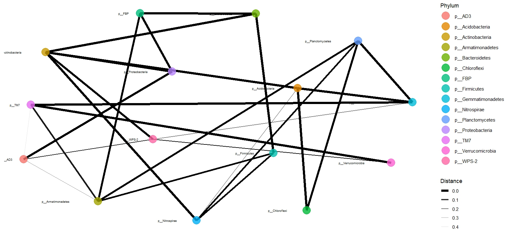

Metagenomic Data Analysis
================
Cemre Kefeli

## Introduction

In this report we will do the reanalysis of data from the paper of
(Mandakovic et al. 2018). In this paper researchers compare microbial
communities in Atacama Desert. They took samples from 8 different sites
with 3 replicates. These sites have in differ pH, temperature, and
nutritional composition. They found that some bacterial communities
persisted across the environmental gradient. Others showed
rearrangements, with some bacteria replacing the ecological roles of
others.

## Materials and Method

### The pipeline

Data of this paper deposited to Sequence Read Archive (SRA) under the
BioProject accession number PRJNA358231. The data is created using 16S
amplicon sequencing. This project have 24 samples in total it is sum
about 784.60 Mb. Bash script `metagenomics_pipeline.sh` contains codes
and instructions for downloading these files. For this analysis we will
use QIIME2, a microbiome bioinformatics platform that have tools for
performing various operations to microbial data (Bolyen et al. 2019).

A sample metadata created within the bash script with the information
extracted from project’s sra webpage. Using QIIME2 data demultiplexed
and denoised. After that, to annotate the OTU’s a pre-trained classifier
downloaded from QIIME2 website. After classification a taxonomy artifact
is created. Otu and taxonomy tables are extracted using `qiime export`
function. These will be used in downstream analysis. Later parts of the
pipeline will be conducted using R.

### Using phyloseq for analysis

Phyloseq (McMurdie and Holmes 2013) is a useful tool for downstream
analysis of microbiome data such as diversity and network analysis or
plotting. The first step involves loading all necessary packages. Next,
otu, taxonomy, and sample data are imported. Only OTUs with 97%
confidence are kept for further analysis. OTU table also filtered
according to this step. The QIIME2 produced taxonomy information in a
single column. That required a separation for further analysis. Otu,
taxonomy matrices and sample metadata combined into phyloseq object.
Alpha diversity, Bray-Curtis distance are calculated for plotting
diversity and PCoA.

## Results

Different diversity indexes provide insights into the relative abundance
of species in samples. The Shannon index emphasizes rare species,
whereas the Simpson index is more sensitive to common species. The
Simpson index reveals that most samples are dominated by a few species.

The principal coordinate analysis of Bray-Curtis distances reveals that
samples from sites 1 and 8 are the most distinct. This corresponds with
the findings in the paper, which show that the two sites have the
greatest geographical separation and the greatest difference in pH.

The plot illustrates the relative abundance of different bacterial phyla
across various samples. Each bar represents a sample, and the colored
segments within each bar show the proportion of each phylum present in
that sample. Actinobacteria seems to be most dominant phylum among the
15 most abundant phyla across all samples. The plot is on par with
paper.

Network of 15 most abundant phyla. Each nodes represents a phylum. Edge
thickness demonstrates degree of the relationship between two phyla.
Thicker the edge means stronger the relationship between the nodes.

## Conclusion

In this report I have made the basic analysis of microbiome data. The
plots are coherent with the analysis presented in the original paper.
The results confirm that the microbial communities in the Atacama Desert
vary significantly across different sites, with the most distinct
communities found at sites 1 and 8. These differences align with
variations in environmental factors such as pH and geographic location.
Additionally, the reanalysis identified Actinobacteria as the most
dominant phylum across all samples, consistent with the original study’s
observations. The network analysis revealed complex interactions among
the 15 most abundant phyla, highlighting the interconnected nature of
the microbial ecosystem in the Atacama Desert. A further analysis may
include a functional analysis of the microbial communities to see which
metabolic processes are the most prominent ones across different
samples.

## References

Bolyen, Evan, Jai Ram Rideout, Matthew R. Dillon, Nicholas A. Bokulich,
Christian C. Abnet, Gabriel A. Al-Ghalith, Harriet Alexander, et al.
2019. “Reproducible, Interactive, Scalable and Extensible Microbiome
Data Science Using QIIME 2.” *Nature Biotechnology* 37 (8): 852–57.
<https://doi.org/10.1038/s41587-019-0209-9>.

Mandakovic, Dinka, Claudia Rojas, Jonathan Maldonado, Mauricio Latorre,
Dante Travisany, Erwan Delage, Audrey Bihouée, et al. 2018. “Structure
and Co-Occurrence Patterns in Microbial Communities Under Acute
Environmental Stress Reveal Ecological Factors Fostering Resilience.”
*Scientific Reports* 8 (1).
<https://doi.org/10.1038/s41598-018-23931-0>.

McMurdie, Paul J., and Susan Holmes. 2013. “Phyloseq: An r Package for
Reproducible Interactive Analysis and Graphics of Microbiome Census
Data.” Edited by Michael Watson. *PLoS ONE* 8 (4): e61217.
<https://doi.org/10.1371/journal.pone.0061217>.

