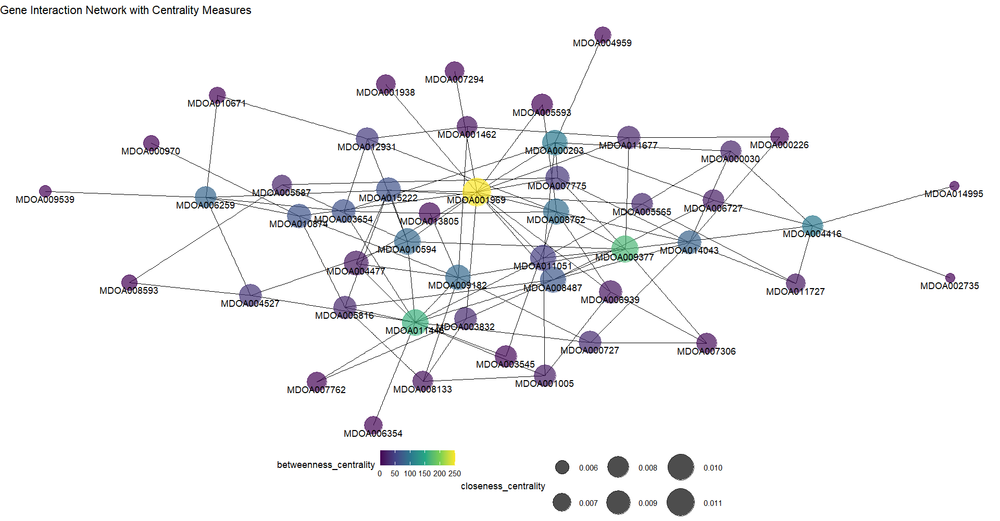
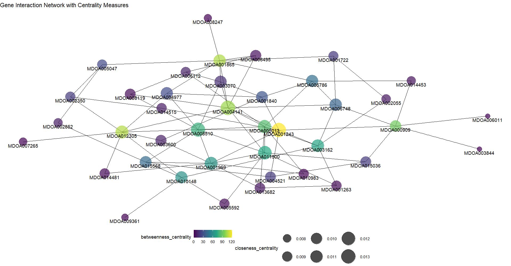
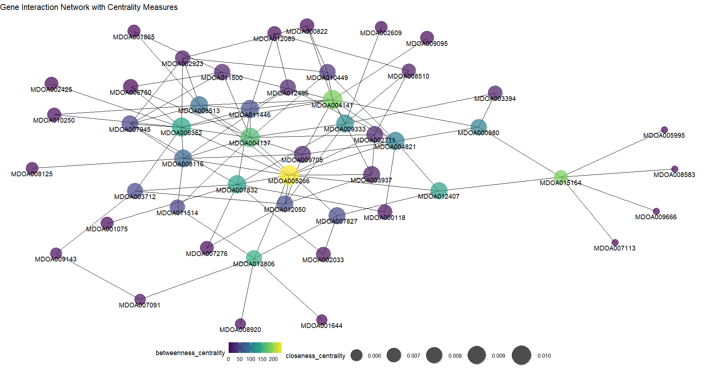
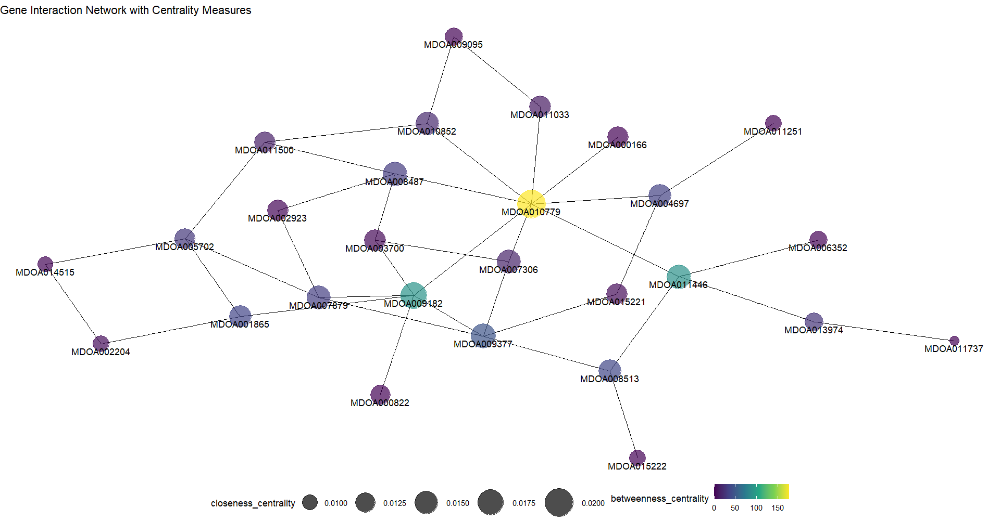

Glasso Analysis
================
Cemre Kefeli

In this Analysis we will try and build gene networks using Graphical
Lasso. We had differentially expressed genes from the previous analysis.
Since the number of these genes are too big to construct a network we
will filter them according the p values end select about top 30 to 100.
We will use the following packages for this analysis.

``` r
library(glasso)
library(ggplot2)
library(ggraph)
library(igraph)
```

The `glasso` package has the `glasso()` function that fits the model.
This function takes two mandatory arguments: S, the covariance matrix
and rho which corresponds to lambda.

But before that we have to transpose the gene expression table where
rows are genes and columns are samples. Since we want to see the network
of genes we should make the genes as variables. Such as this:

<table>
<caption>
Transposed gene expression data
</caption>
<thead>
<tr>
<th style="text-align:left;">
</th>
<th style="text-align:right;">
MDOA000909
</th>
<th style="text-align:right;">
MDOA000990
</th>
<th style="text-align:right;">
MDOA001263
</th>
<th style="text-align:right;">
MDOA001722
</th>
<th style="text-align:right;">
MDOA001840
</th>
<th style="text-align:right;">
MDOA001865
</th>
</tr>
</thead>
<tbody>
<tr>
<td style="text-align:left;">
BS1
</td>
<td style="text-align:right;">
-6.907755
</td>
<td style="text-align:right;">
-6.907755
</td>
<td style="text-align:right;">
-6.907755
</td>
<td style="text-align:right;">
-6.907755
</td>
<td style="text-align:right;">
-6.907755
</td>
<td style="text-align:right;">
-6.9077553
</td>
</tr>
<tr>
<td style="text-align:left;">
BS2
</td>
<td style="text-align:right;">
-6.907755
</td>
<td style="text-align:right;">
-6.907755
</td>
<td style="text-align:right;">
-6.907755
</td>
<td style="text-align:right;">
-6.907755
</td>
<td style="text-align:right;">
-6.907755
</td>
<td style="text-align:right;">
-6.9077553
</td>
</tr>
<tr>
<td style="text-align:left;">
BC1
</td>
<td style="text-align:right;">
-6.907755
</td>
<td style="text-align:right;">
-6.907755
</td>
<td style="text-align:right;">
-6.907755
</td>
<td style="text-align:right;">
-6.907755
</td>
<td style="text-align:right;">
-6.907755
</td>
<td style="text-align:right;">
-6.9077553
</td>
</tr>
<tr>
<td style="text-align:left;">
BC2
</td>
<td style="text-align:right;">
-6.907755
</td>
<td style="text-align:right;">
-6.907755
</td>
<td style="text-align:right;">
-6.907755
</td>
<td style="text-align:right;">
-6.907755
</td>
<td style="text-align:right;">
-6.907755
</td>
<td style="text-align:right;">
-6.9077553
</td>
</tr>
<tr>
<td style="text-align:left;">
G1
</td>
<td style="text-align:right;">
2.079566
</td>
<td style="text-align:right;">
3.401231
</td>
<td style="text-align:right;">
2.890427
</td>
<td style="text-align:right;">
1.609638
</td>
<td style="text-align:right;">
2.302685
</td>
<td style="text-align:right;">
0.6936471
</td>
</tr>
<tr>
<td style="text-align:left;">
G2
</td>
<td style="text-align:right;">
2.995782
</td>
<td style="text-align:right;">
3.178095
</td>
<td style="text-align:right;">
2.079566
</td>
<td style="text-align:right;">
2.397986
</td>
<td style="text-align:right;">
1.386544
</td>
<td style="text-align:right;">
0.0009995
</td>
</tr>
<tr>
<td style="text-align:left;">
GBE1
</td>
<td style="text-align:right;">
2.197336
</td>
<td style="text-align:right;">
3.891841
</td>
<td style="text-align:right;">
3.178095
</td>
<td style="text-align:right;">
3.828663
</td>
<td style="text-align:right;">
1.946053
</td>
<td style="text-align:right;">
-6.9077553
</td>
</tr>
<tr>
<td style="text-align:left;">
GBE2
</td>
<td style="text-align:right;">
2.197336
</td>
<td style="text-align:right;">
4.060460
</td>
<td style="text-align:right;">
2.197336
</td>
<td style="text-align:right;">
4.499821
</td>
<td style="text-align:right;">
1.098946
</td>
<td style="text-align:right;">
-6.9077553
</td>
</tr>
<tr>
<td style="text-align:left;">
DC1
</td>
<td style="text-align:right;">
5.337543
</td>
<td style="text-align:right;">
3.871222
</td>
<td style="text-align:right;">
3.583547
</td>
<td style="text-align:right;">
5.545181
</td>
<td style="text-align:right;">
5.891647
</td>
<td style="text-align:right;">
3.2958739
</td>
</tr>
<tr>
<td style="text-align:left;">
DC2
</td>
<td style="text-align:right;">
5.342339
</td>
<td style="text-align:right;">
4.465920
</td>
<td style="text-align:right;">
2.995782
</td>
<td style="text-align:right;">
5.924258
</td>
<td style="text-align:right;">
5.942802
</td>
<td style="text-align:right;">
2.7081169
</td>
</tr>
</tbody>
</table>

Now we will compute the covariance matrix.

``` r
covariance_matrix <-cov(expression_table)
dim(covariance_matrix)
```

    ## [1] 31 31

This matrix pxp dimensions. Now we can use glasso estimator. I
arbitrarily chose rho as 0.01.

``` r
glasso_result <- glasso(covariance_matrix, rho = 0.01)
```

We will use the following command to access the adjacency matrix. We
will use this matrix to build the graph.

``` r
adjacency_matrix <- glasso_result$wi
dim(adjacency_matrix)
```

    ## [1] 31 31

``` r
network_graph <- graph.adjacency(adjacency_matrix, mode = "max")
```

Before plotting the graph we need to calculate some centrality measures.

``` r
betweenness_centrality <- betweenness(network_graph)
closeness_centrality <- closeness(network_graph)
```

``` r
  ggraph(network_graph) +
    geom_edge_link() +
    geom_node_point(aes(size = closeness_centrality, color = betweenness_centrality), alpha = 0.7) +
    geom_node_text(aes(label = ""), vjust = 1.5, hjust = 1.5) +
    scale_size_continuous(range = c(5, 15)) +
    scale_color_viridis_c() +
    scale_edge_width_continuous(range = c(1, 5)) +
    theme_void() +
    theme(legend.position = "bottom") +
    labs(title = "Gene Interaction Network with Centrality Measures") + 
    geom_node_text(aes(label = colnames(adjacency_matrix)), vjust = 1.5)
```

## Interpretation of Plots

I build 4 graphs for each contrast. In this part of the analysis I will
try and interpret them. I used vectorbase to annotate the most prominent
genes in graphs.

#### Syncytial Blastoderm vs. Cellular Blastoderm



Unfortunately gene represented by yellow dot, MDOA001969 which looks
like the most important node on the graph resulted as unidentified
product in annotation search. The other prominent genes, MDOA009377 and
MDOA011445 annotated as proto-oncogene c-Fos and transketolase-like
protein 2 respectively. c-Fos is a proto-oncogene and also a gene that
take many important roles in embryogenesis such as proliferation and
differentiation. It is characterized as an immediate early response
gene. These group of genes act immediately upon triggered with stimuli.
Such group of genes also include c-myc, a Wnt signaling target. c-Fos
has been a marker for neuronal activity and important actor in neuronal
development (Velazquez, Caputto, and Boussin 2015).

#### Cellular Blastoderm vs. Gastrula



The gene MDOA004141 annotated as cuticle protein 7. Although other more
prominent genes on the graph do not annotated with any specified product
they were all protein coding genes. I could not find any specific
information about cuticle protein 7. Since we are analyzing an insect it
seems logical. One paper suggested that that more than 1% of protein
encoding genes in insects are cuticle and chitin proteins (Pan et al.
2018).

#### Gastrula vs. Germ Band Extension



At the very center of the graph the yellow dot MDOA005266 annotated as
carbonic anhydrase enzyme. This enzyme catalizes one of the most common
reaction in nature: two way conversion of carbondioxide and carbonic
acid. Which is an important reaction in respiration. Another node,
MDOA013806, Osi19 is a member of Osiris gene family. These gene are
associated with octanoic acid resistance (Lanno et al. 2019). Octanoic
acid (Also known as caprylic acid) used as fungicide, pesticide and
herbicide. This family of genes also associated with trachea formation
in *Drosophila* (Scholl et al. 2023).

#### Germ Band Extension vs. Dorsal Closure



The yellow node, MDOA010779 was an unspecified product. Node MDOA009182
annotated as glycoprotein hormone beta-5 which is a glycoprotein subunit
that has thyrostimulating effect. There is a *Drosophila* homolog of
this gene which indicates an evolutionary conservation of this gene
(Sudo et al. 2005).

# Referencess

<div id="refs" class="references csl-bib-body hanging-indent"
entry-spacing="0">

<div id="ref-Lanno2019" class="csl-entry">

Lanno, Stephen M., Serena J. Shimshak, Rubye D. Peyser, Samuel C. Linde,
and Joseph D. Coolon. 2019. “Investigating the Role of Osiris Genes in
Drosophila Sechellia Larval Resistance to a Host Plant Toxin.” *Ecology
and Evolution* 9 (4): 1922–33. <https://doi.org/10.1002/ece3.4885>.

</div>

<div id="ref-Pan2018" class="csl-entry">

Pan, Peng-Lu, Yu-Xuan Ye, Yi-Han Lou, Jia-Bao Lu, Chen Cheng, Yan Shen,
Bernard Moussian, and Chuan-Xi Zhang. 2018. “A Comprehensive Omics
Analysis and Functional Survey of Cuticular Proteins in the Brown
Planthopper.” *Proceedings of the National Academy of Sciences* 115
(20): 5175–80. <https://doi.org/10.1073/pnas.1716951115>.

</div>

<div id="ref-Scholl2023" class="csl-entry">

Scholl, Aaron, Istri Ndoja, Niraj Dhakal, Doria Morante, Abigail Ivan,
Darren Newman, Thomas Mossington, et al. 2023. “The Osiris Family Genes
Function as Novel Regulators of the Tube Maturation Process in the
Drosophila Trachea.” Edited by Greg Joseph Beitel. *PLOS Genetics* 19
(1): e1010571. <https://doi.org/10.1371/journal.pgen.1010571>.

</div>

<div id="ref-Sudo2005" class="csl-entry">

Sudo, Satoko, Yoshimitsu Kuwabara, Jae-Il Park, Sheau Yu Hsu, and Aaron
J. W. Hsueh. 2005. “Heterodimeric Fly Glycoprotein Hormone-Α2 (GPA2) and
Glycoprotein Hormone-Β5 (GPB5) Activate Fly Leucine-Rich
Repeat-Containing g Protein-Coupled Receptor-1 (DLGR1) and Stimulation
of Human Thyrotropin Receptors by Chimeric Fly GPA2 and Human GPB5.”
*Endocrinology* 146 (8): 3596–3604.
<https://doi.org/10.1210/en.2005-0317>.

</div>

<div id="ref-Velazquez2015" class="csl-entry">

Velazquez, Fabiola N., Beatriz L. Caputto, and François D. Boussin.
2015. “C-Fos Importance for Brain Development.” *Aging* 7 (12): 1028–29.
<https://doi.org/10.18632/aging.100862>.

</div>

</div>
