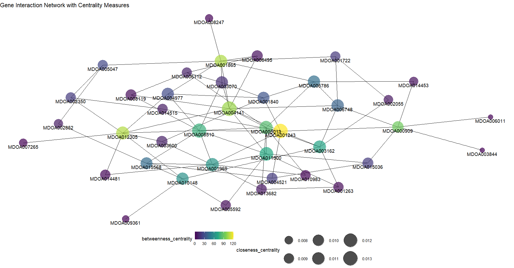

```{r setup, include=FALSE}
knitr::opts_chunk$set(echo = TRUE)
```


In this Analysis we will try and build gene networks using Graphical Lasso. We had differentially expressed genes from the previous analysis. Since the number of these genes are too big to construct a network we will filter them according the p values end select about top 30 to 100. We will use the following packages for this analysis.

```{r, message=FALSE}
library(glasso)
library(ggplot2)
library(ggraph)
library(igraph)
```

The `glasso` package has the `glasso()` function that fits the model. This function takes two mandatory arguments: S, the covariance matrix and rho which corresponds to lambda.

But before that we have to transpose the gene expression table where rows are genes and columns are samples. Since we want to see the network of genes we should make the genes as variables. Such as this:


```{r, echo=FALSE}
expression_table <- read.table(file = "ornek", row.names = 1)

# Using knitr::kable without kableExtra
knitr::kable(expression_table[1:6], format = "html", caption = "Transposed gene expression data")

```

Now we will compute the covariance matrix.

```{r}
covariance_matrix <-cov(expression_table)
dim(covariance_matrix)
```

This matrix pxp dimensions. Now we can use glasso estimator. I arbitrarily chose rho as 0.01.
```{r}
glasso_result <- glasso(covariance_matrix, rho = 0.01)
```

We will use the following command to access the adjacency matrix. We will use this matrix to build the graph.

```{r}
adjacency_matrix <- glasso_result$wi
dim(adjacency_matrix)
```
```{r, echo=FALSE}
colnames(adjacency_matrix) <- colnames(covariance_matrix)
```


```{r}
network_graph <- graph.adjacency(adjacency_matrix, mode = "max")
```


Before plotting the graph we need to calculate some centrality measures.

```{r}
betweenness_centrality <- betweenness(network_graph)
closeness_centrality <- closeness(network_graph)
```

```{r, warning=FALSE, message=FALSE}
  ggraph(network_graph) +
    geom_edge_link() +
    geom_node_point(aes(size = closeness_centrality, color = betweenness_centrality), alpha = 0.7) +
    geom_node_text(aes(label = ""), vjust = 1.5, hjust = 1.5) +
    scale_size_continuous(range = c(5, 15)) +
    scale_color_viridis_c() +
    scale_edge_width_continuous(range = c(1, 5)) +
    theme_void() +
    theme(legend.position = "bottom") +
    labs(title = "Gene Interaction Network with Centrality Measures") + 
    geom_node_text(aes(label = colnames(adjacency_matrix)), vjust = 1.5)
```

## Interpretation of Plots

I build 4 graphs for each contrast. In this part of the analysis I will try and interpret them. I used vectorbase to annotate the most prominent genes in graphs.

#### Syncytial Blastoderm vs. Cellular Blastoderm

```{r, echo=FALSE}
knitr::include_graphics("network1.png")
```

Unfortunately gene represented by yellow dot, MDOA001969 which looks like the most important node on the graph resulted as unidentified product in annotation search. The other prominent genes, MDOA009377 and MDOA011445 annotated as proto-oncogene c-Fos and transketolase-like protein 2 respectively. c-Fos is a proto-oncogene and also a gene that take many important roles in embryogenesis such as proliferation and differentiation. It is characterized as an immediate early response gene. These group of genes act immediately upon triggered with stimuli. Such group of genes also include c-myc, a Wnt signaling target. c-Fos has been a marker for neuronal activity and important actor in neuronal development [@Velazquez2015].

#### Cellular Blastoderm vs. Gastrula

```{r, echo=FALSE}

```

The gene MDOA004141 annotated as cuticle protein 7. Although other more prominent genes on the graph do not annotated with any specified product they were all protein coding genes. I could not find any specific information about cuticle protein 7. Since we are analyzing an insect it seems logical. One paper suggested that that more than 1% of protein encoding genes in insects are cuticle and chitin proteins [@Pan2018].

#### Gastrula vs. Germ Band Extension

```{r, echo=FALSE}
knitr::include_graphics("network3.png")
```

At the very center of the graph the yellow dot MDOA005266 annotated as carbonic anhydrase enzyme. This enzyme catalizes one of the most common reaction in nature: two way conversion of carbondioxide and carbonic acid. Which is an important reaction in respiration. Another node, MDOA013806, Osi19 is a member of Osiris gene family. These gene are associated with octanoic acid resistance [@Lanno2019]. Octanoic acid (Also known as caprylic acid) used as fungicide, pesticide and herbicide. This family of genes also associated with trachea formation in _Drosophila_ [@Scholl2023].

#### Germ Band Extension vs. Dorsal Closure

```{r, echo=FALSE}
knitr::include_graphics("network4.png")
```


The yellow node, MDOA010779 was an unspecified product. Node MDOA009182 annotated as glycoprotein hormone beta-5 which is a glycoprotein subunit that has thyrostimulating effect. There is a _Drosophila_ homolog of this gene which indicates an evolutionary conservation of this gene [@Sudo2005].


# Referencess