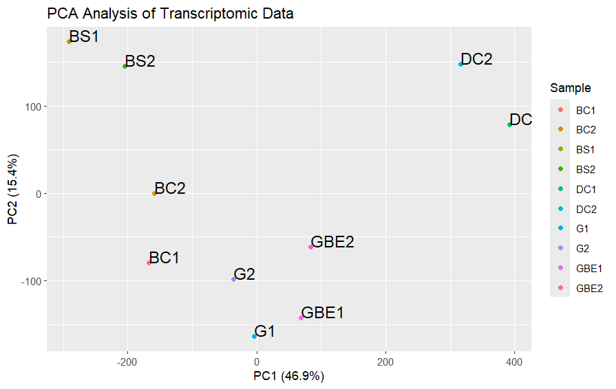
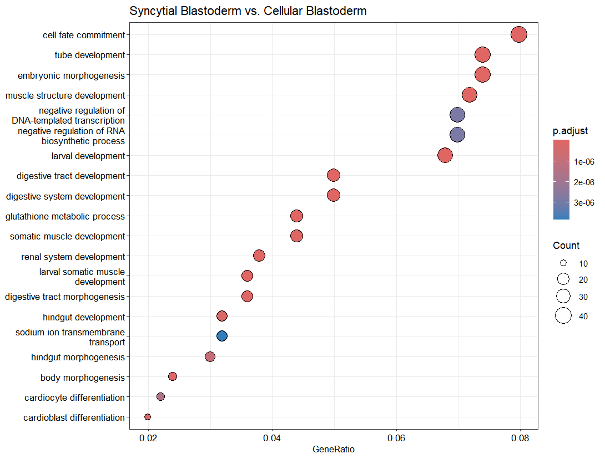
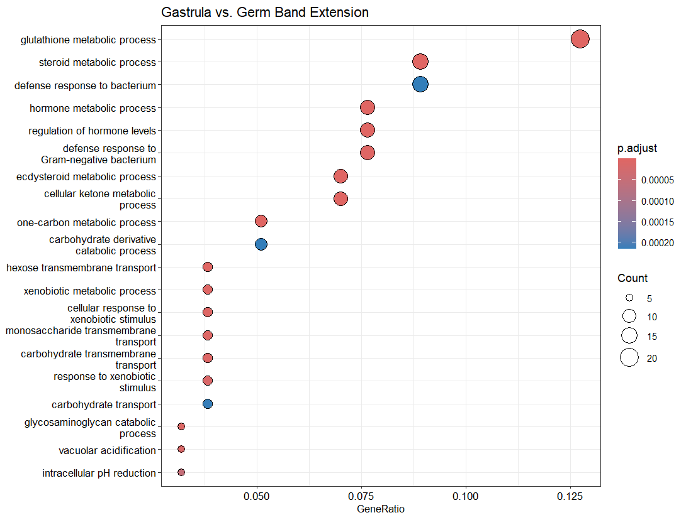
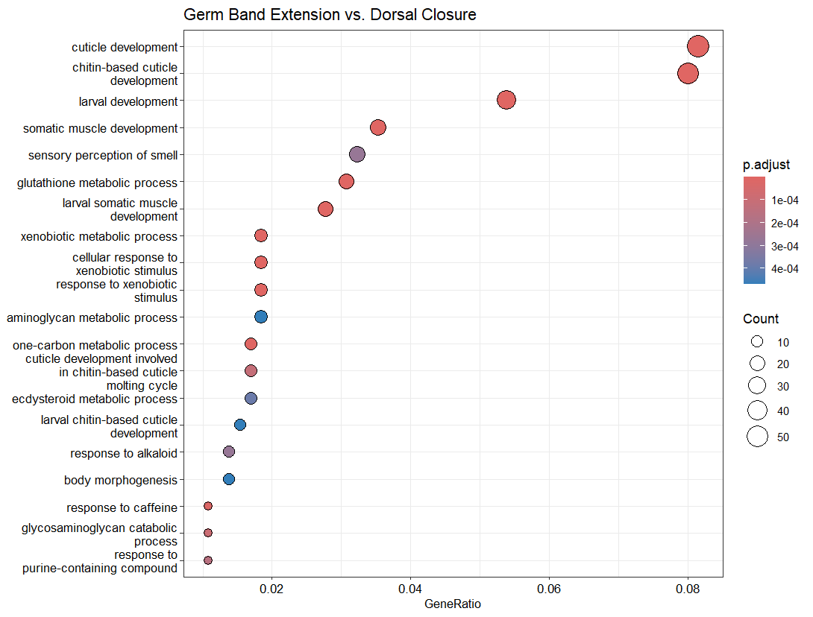
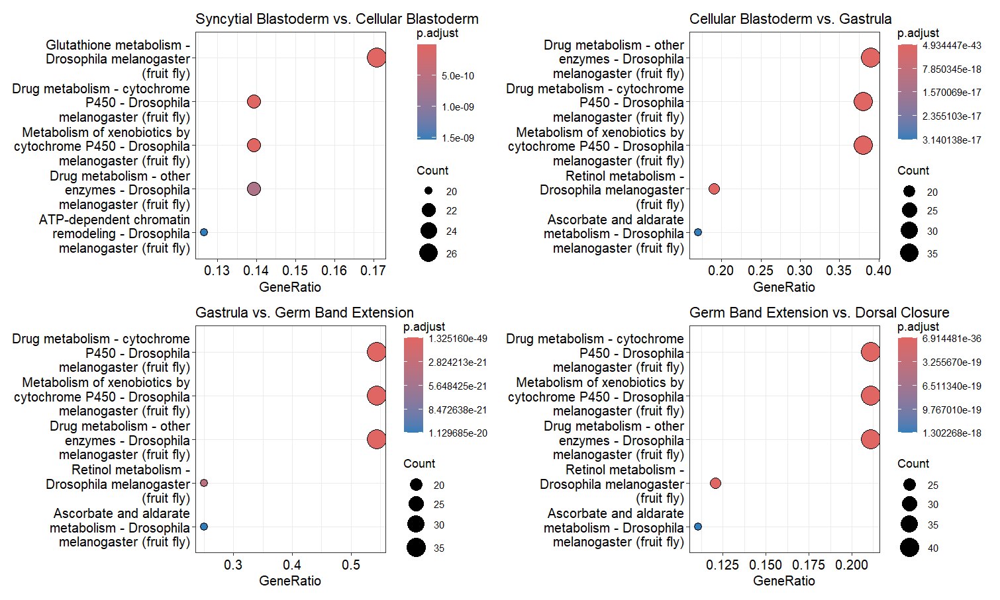
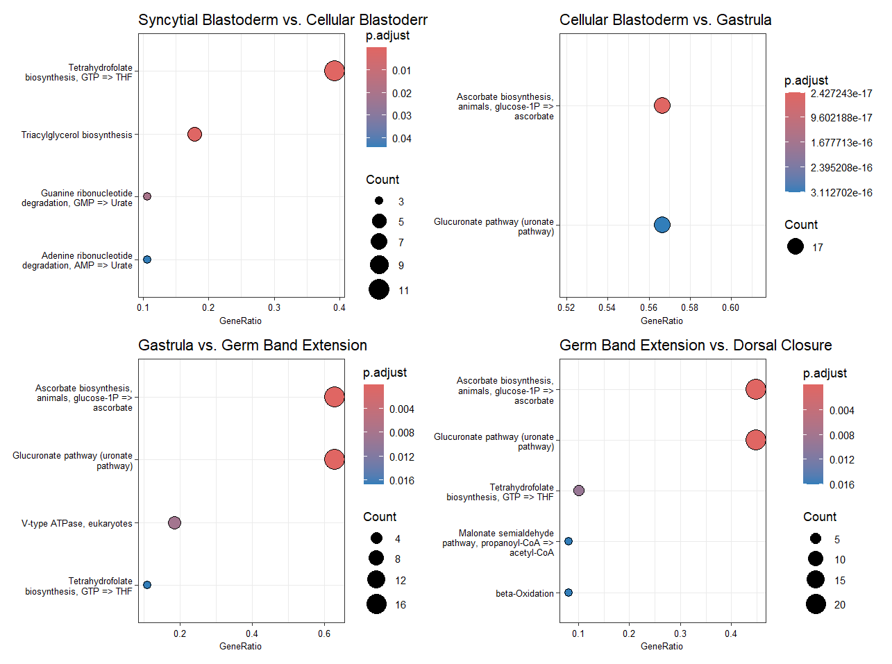

Musca Domestica sequencing analysis
================
Cemre Kefeli

In this report I will do an analysis of *Musca domestica* RNA-sequencing
data. I downloaded the raw count numbers from the GEO page of the
experiment GSE85160. This experiment has 10 samples and 5 levels. These
levels correspond to 5 consequetive stages in early embryonic
development of *Musca domestica*.

First we will do preprocessing and tyding up the count data.

``` r
# Loading libraries
library(dplyr)
library(purrr)
library(tidyverse)
library(limma)
library(clusterProfiler)
library(org.Dm.eg.db)
library(knitr)

# Reading local files to R
files_to_read <- list.files(path ="GSE85160_RAW/", pattern = "\\.txt$", full.names = TRUE)
all_files <- lapply(files_to_read, function(x) {
  read.table(file = x, 
             sep = '\t', 
             header = FALSE)
})
names(all_files) <- files_to_read

# Merging large list into a dataframe and adding the sample names
musca <- Reduce(function(x, y) merge(x, y, by = "V1", all = TRUE), all_files) %>% 
  replace(., is.na(.), 0)
colnames(musca) <- c("id", "BS1", "BS2", "BC1", "BC2", "G1", "G2", "GBE1", "GBE2", "DC1", "DC2")

# Subsetting the rows that only start with MDOA id names
pattern <- "MDOA"
df <- musca[grepl(pattern, musca$id), ]

# Filtering the rows that have any column with counts below 10
df_filtered <- df %>%
  filter(rowSums(dplyr::select(., -c("id")) > 10) > 0)
```

After tidying the data looks like this:

| id         |  BS1 |  BS2 |  BC1 |  BC2 |   G1 |   G2 | GBE1 | GBE2 |  DC1 |  DC2 |
|:-----------|-----:|-----:|-----:|-----:|-----:|-----:|-----:|-----:|-----:|-----:|
| MDOA000001 | 1226 | 3282 | 1714 | 3103 |  531 |  549 |  675 | 1410 | 1098 | 2540 |
| MDOA000002 |    1 |    2 | 2357 |  584 | 4666 | 1573 | 4027 | 1820 | 4522 |  860 |
| MDOA000003 | 1429 | 2962 | 4180 | 2692 | 2508 |  959 | 2022 |  540 | 2335 |  664 |
| MDOA000004 |    0 |    0 |    0 |    4 |    0 |    0 |    0 |    0 |  101 |    0 |
| MDOA000005 |  825 | 3244 | 3869 | 2862 | 2978 | 3798 | 3164 | 4194 | 2434 | 2942 |
| MDOA000006 |   11 |    1 |    6 |    0 |    9 |   17 |   47 |   14 | 1468 |   74 |

We should remove the gene identifiers and set them as rownames for the
analysis.

``` r
df_filtered <- column_to_rownames(df_filtered, "id")
kable(head(df_filtered))
```

|            |  BS1 |  BS2 |  BC1 |  BC2 |   G1 |   G2 | GBE1 | GBE2 |  DC1 |  DC2 |
|:-----------|-----:|-----:|-----:|-----:|-----:|-----:|-----:|-----:|-----:|-----:|
| MDOA000001 | 1226 | 3282 | 1714 | 3103 |  531 |  549 |  675 | 1410 | 1098 | 2540 |
| MDOA000002 |    1 |    2 | 2357 |  584 | 4666 | 1573 | 4027 | 1820 | 4522 |  860 |
| MDOA000003 | 1429 | 2962 | 4180 | 2692 | 2508 |  959 | 2022 |  540 | 2335 |  664 |
| MDOA000004 |    0 |    0 |    0 |    4 |    0 |    0 |    0 |    0 |  101 |    0 |
| MDOA000005 |  825 | 3244 | 3869 | 2862 | 2978 | 3798 | 3164 | 4194 | 2434 | 2942 |
| MDOA000006 |   11 |    1 |    6 |    0 |    9 |   17 |   47 |   14 | 1468 |   74 |

Before using `limma` for differential expression we need to log
transform the data. But we have zeros in our data. Therefor we will add
a very small number to the zeros so that we can log transform.

``` r
x = 0.001
df <-log(df_filtered+x)
```

Now we can do `limma` for differential expression.

``` r
design <- model.matrix(~0 + factor(c(1,1,2,2,3,3,4,4,5,5)))
colnames(design) <- c("BS", "BC", "G", "GBE", "DC")
fit <- lmFit(df, design)
cont_matrix <- makeContrasts(SBvsCB = BS-BC, BCvsG = BC-G, GvsGBE = G-GBE, GBEvsDC=GBE-DC, levels=design)
contrasts <- contrasts.fit(fit, contrast = cont_matrix)
fit2 <-eBayes(contrasts)
```

To see how different the groups are we will now do PCA.

``` r
library(ggplot2)

#Performing the PCA, prcomp comes with limma

pca_result <- prcomp(t(df))
pc_data <- as.data.frame(pca_result$x[, 1:2])
pc_var <- (pca_result$sdev^2) / sum(pca_result$sdev^2) * 100
pc_data$Sample <- rownames(pc_data)

#Plotting with ggplot2

ggplot(pc_data, aes(x = PC1, y = PC2, color = Sample, label = Sample)) +
geom_point() +
geom_text(hjust = 0, vjust = 0, size = 5, color = "black") +
labs(title = "PCA Analysis of Transcriptomic Data") +
scale_x_continuous(name = paste("PC1 (", round(pc_var[1], 1), "%)", sep = "")) +
scale_y_continuous(name = paste("PC2 (", round(pc_var[2], 1), "%)", sep = ""))
```

<!-- -->



To interpret differential gene expression I wanted to do a gene ontology
or some kind of enrichment analysis. To do that I needed to convert gene
ids to entrez or ensembl etc. because tools for ontology expect these
ids or similar. Or I needed to have a .db file for *Musca domestica* but
unfortunately there is none. After some search I found
www.vectorbase.org which is a page that contains, as they say in the
website *“Bioinformatic resources for intervertebrate vectors of human
pathogens”*. You can even do ontology analysis in the website with the
“MDOA” ids. It was nice but it returns only a table that contain
information about the ontologies. I wanted something more graphical. To
do that I had to take a different approach.

In vectorbase you can also find orthologs of the genes you want. Since
*Drosophila melanogaster* is more annotated and studied compared to
*Musca domestica*, I made a query for ids of the differentially
expressed genes’ drosophila orthologs. I downloaded annotated *Musca
domestica* gene ids with FlyBase identifiers on vectorbase.

Now I will use `clusterProfiler` package for ontology analysis

``` r
#Using Drosophila database

organism <- org.Dm.eg.db

#Clustering

enrich_result3 <- enrichGO(gene = Fly3,
OrgDb = organism, 
keyType = "FLYBASE",
ont = "BP")

#Plotting the results

dotplot(enrich_result, showCategory = 20)
```

### Gene Ontology (GO) Enrichment



Syncytial blastoderm and cellular blastoderm are the first two
consecutive stages of *Musca domestica* embryogenesis. In syncytial
stage the nuclei divide but the cell don’t. This creates a cell that has
many nuclei called syncytium. This is a hallmark of insect
embryogenesis. In the 14th cell cycle the nuclei are separated to their
own enclosed cytoplasm and create cellular blastoderm.

As shown in the graph cell fate commitment is the most enriched
biological process between these two developmental stages. Cells commit
to certain fate very early in embryogenesis. This means each cell has
biochemically determined to differentiate into certain type of cell. At
this early stage of development it is sensible say that cells -with some
biological processes- are decided to differentiate into different types
of cells. We can also see the enrichment of differentiation,
development, and morphogenesis of several types of systems in the graph,
supporting the idea of early development and differentiation associated
with these two developmental stage.


Glutathione metabolic process seems to be very important for the
embryonic development since it is enriched in all the graphs. It is a
thiol molecule that act as an antioxidant agent and protects the cells
from oxidative stress. It also acts on xenobiotic metabolism and
neutralizes the harmful effects of xenobiotic compounds Timme-Laragy et
al. (2013). Similar enrichment analysis was conducted in the porcine
embryos and they also showed that glutathione processes are the most
enriched (Weijden et al. 2021). So this is not something particular to
diptera or insects.

At this stage there are also many procesess about the cAMP or cyclic
nucleotides. These signaling molecules are secondary messengers and have
important role in signal transduction. I think they are enriched because
at this stage of development a lot of signaling going on between
pathways. Because gastrulation process is division of embryonic cells
into three different layers which I believe it involve many
intracellular signaling events.



In here we also see glutathione enrichment and xenobiotic metabolic
response. We also see ecdysteroid metabolic processes. Ecdystreoids are
hormones which regulate the transition between developmental stages
(Takeuchi et al. 2005). One study suggests that glutathione is needed
for ecdysteroid biosyntesis (Enya et al. 2017).



One thing particularly interesting in here is the early development of
sense of smell since these insects are drawn to putrid odors.

### KEGG Pathways

For creating the kegg pathway enrichments I used `enrichKEGG` function
from `clusterProfiler` library. For the kegg modules the function is
`enrichMKEGG`. The process is similar to GO except I had to map ids once
again because it only accept the ids that look like “Dmel_CG0001”. I
used `mapIds` function to map the ids from “FLYBASE” to “FLYBASECG” and
add the “Dmel\_” part with `gsub`.



We see a cluster of cytochrome P450 enrichment. P450 is actually a
superfamily of hemoproteins that has many members. They take part in
detoxification of drugs, xenobiotics etc. In insects, along with
glutathione-S-transferase (GST) family they are associated with
insecticide resistance (Willoughby et al. 2006). One study suggest that
increased levels of P450 associated with *Musca domestica* insecticide
resistance (Tomita et al. 1995).

In GO enrichments above we see a caffeine response. Caffeine is reported
to be a natural insecticide and also it triggers some members of the
P450 family (Willoughby et al. 2006).

### KEGG Modules

In biology.stackexchange.com one person explained the difference between
KEGG pathways and modules this way : *“A pathway shows all the reactions
required for the synthesis / metabolism of a given product. A module is
a functional unit that can be utilized in a pathway, and some modules
are common to many pathways.”*



Glucuronate pathway, or glucuronidation is a way to eliminate the
xenobiotics. Glucuronidated substrates became water-soluable so they can
be easily removed from the organism/body/cell. In previous steps we have
seen processes involved in xenobiotic metabolism. Glucuronate pathway
enrichment also supports these results. Also glucuronate takes place in
ascorbate (vitamin C) biosynthesis. In a way it is a precursor of
vitamin C.

### Disscussion and Conclusion

In the end, there were suprisingly cluster of enrichment of xenobiotic
metabolism and processes associated with eliminating them. I still have
a question if this processes natural part of *Musca domestica*
development or is it triggered by an insecticide from possibly previous
generations. Another possibility is that it maybe shows this strain has
some resistance to the insecticides.

### References

<div id="refs" class="references csl-bib-body hanging-indent"
entry-spacing="0">

<div id="ref-Enya2017" class="csl-entry">

Enya, Sora, Chikana Yamamoto, Hajime Mizuno, Tsuyoshi Esaki, Hsin-Kuang
Lin, Masatoshi Iga, Kana Morohashi, et al. 2017. “Dual Roles of
Glutathione in Ecdysone Biosynthesis and Antioxidant Function During
Larval Development in Drosophila.” *Genetics* 207 (4): 1519–32.
<https://doi.org/10.1534/genetics.117.300391>.

</div>

<div id="ref-Ketterer1982" class="csl-entry">

Ketterer, Brian. 1982. “The Role of Nonenzymatic Reactions of
Glutathione in Xenobiotic Metabolism.” *Drug Metabolism Reviews* 13 (1):
161–87. <https://doi.org/10.3109/03602538209002234>.

</div>

<div id="ref-Takeuchi2005" class="csl-entry">

Takeuchi, Hajime, Daniel J. Rigden, Bahram Ebrahimi, Philip C. Turner,
and Huw H. Rees. 2005. “Regulation of Ecdysteroid Signalling During
Drosophila Development: Identification, Characterization and Modelling
of Ecdysone Oxidase, an Enzyme Involved in Control of Ligand
Concentration.” *Biochemical Journal* 389 (3): 637–45.
<https://doi.org/10.1042/bj20050498>.

</div>

<div id="ref-TimmeLaragy2013" class="csl-entry">

Timme-Laragy, Alicia R., Jared V. Goldstone, Barry R. Imhoff, John J.
Stegeman, Mark E. Hahn, and Jason M. Hansen. 2013. “Glutathione Redox
Dynamics and Expression of Glutathione-Related Genes in the Developing
Embryo.” *Free Radical Biology and Medicine* 65 (December): 89–101.
<https://doi.org/10.1016/j.freeradbiomed.2013.06.011>.

</div>

<div id="ref-Tomita1995" class="csl-entry">

Tomita, T., N. Liu, F. F. Smith, P. Sridhar, and J. G. Scott. 1995.
“Molecular Mechanisms Involved in Increased Expression of a Cytochrome
P450 Responsible for Pyrethroid Resistance in the Housefly, Musca
Domestica.” *Insect Molecular Biology* 4 (3): 135–40.
<https://doi.org/10.1111/j.1365-2583.1995.tb00018.x>.

</div>

<div id="ref-vanderWeijden2021" class="csl-entry">

Weijden, Vera A. van der, Meret Schmidhauser, Mayuko Kurome, Johannes
Knubben, Veronika L. Flöter, Eckhard Wolf, and Susanne E. Ulbrich. 2021.
“Transcriptome Dynamics in Early in Vivo Developing and in Vitro
Produced Porcine Embryos.” *BMC Genomics* 22 (1).
<https://doi.org/10.1186/s12864-021-07430-7>.

</div>

<div id="ref-Willoughby2006" class="csl-entry">

Willoughby, Lee, Henry Chung, Chris Lumb, Charles Robin, Philip
Batterham, and Phillip J. Daborn. 2006. “A Comparison of Drosophila
Melanogaster Detoxification Gene Induction Responses for Six
Insecticides, Caffeine and Phenobarbital.” *Insect Biochemistry and
Molecular Biology* 36 (12): 934–42.
<https://doi.org/10.1016/j.ibmb.2006.09.004>.

</div>

</div>
